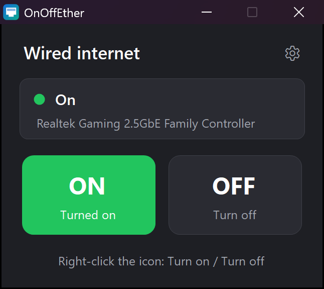

# OnOffEther

Turn your wired (Ethernet) internet on and off with one click, on Windows 10 and 11.

**Website:** https://divolandialabs.github.io/onoffether/ · **Download:** [latest release](https://github.com/divolandialabs/onoffether/releases/latest)



## What it does

- A small panel with **ON** and **OFF** buttons, and a live line telling you whether the cable is connected.
- **Right-click** the pinned taskbar icon to switch straight away, without opening the app.
- **No permission prompts** after installing: administrator rights are requested once, during setup.
- Light and dark **themes**, and five **languages** (English, Spanish, French, German, Portuguese).
- 121 KB, no background service, no updater, no telemetry.

## How it works

The app enables or disables the physical Ethernet adapter, exactly as you would in Device Manager, through the network interfaces built into Windows. Wi-Fi, Bluetooth and virtual adapters are never touched.

Switching an adapter requires administrator rights. The installer registers two Windows scheduled tasks — `OnOffEther_On` and `OnOffEther_Off` — that run with those rights, so the app itself can stay unelevated and never prompts you. Both tasks are deleted when you uninstall.

## Install

1. Download `OnOffEther-Setup-x.y.z.exe` from the [releases page](https://github.com/divolandialabs/onoffether/releases/latest) and run it.
2. Pick your language, press **Install**.
3. Press **Open OnOffEther**, then right-click its taskbar icon and choose **Pin to taskbar**.

To uninstall: Settings → Apps → Installed apps → OnOffEther. If the wired connection is off at that moment, it is switched back on first.

### Silent install

For deployments and for the Microsoft Store:

```
OnOffEther-Setup-1.5.0.exe /S                 install, no window
OnOffEther-Setup-1.5.0.exe /S /desktop        also create a desktop shortcut
OnOffEther-Setup-1.5.0.exe /S /lang=es        set the default language (en, es, fr, de, pt)
"C:\Program Files\OnOffEther\OnOffEther.exe" /uninstall /silent
```

Exit codes: `0` success · `1602` cancelled by the user · `1603` failure · `1925` administrator rights required.

## Privacy

The app collects nothing and makes no internet connections of its own. Only two preferences — theme and language — are stored locally, and they are removed when you uninstall. Full text: [privacy policy](https://divolandialabs.github.io/onoffether/privacy.html).

## Support

Questions, bugs and ideas: [open an issue](https://github.com/divolandialabs/onoffether/issues). It helps to include your Windows version and the name of your network card (the grey line in the middle of the panel).

## Requirements

Windows 10 or 11, a wired Ethernet adapter, and administrator rights to install or uninstall.

---

© 2026 Divolandia Labs. Free to use and redistribute unmodified; see the [terms of use](https://divolandialabs.github.io/onoffether/terms.html). This repository hosts the website and the released installer, not the source code.
